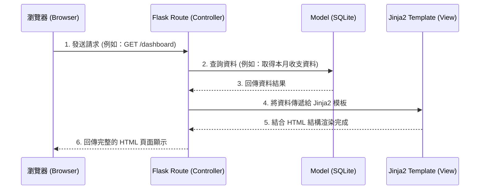

# 系統架構設計文件 - 個人記帳簿

## 1. 技術架構說明

為了符合快速開發的需求，本專案將採用輕量級的後端框架與關聯式資料庫。整體系統採用傳統的伺服器端渲染 (Server-Side Rendering) 架構，而非前後端分離。

- **後端框架**：**Python + Flask**
  - **原因**：Flask 是輕量級且靈活的框架，學習曲線平緩，非常適合用來快速建立 Web 應用程式的 MVP（最小可行性產品）。
- **模板引擎**：**Jinja2**
  - **原因**：Jinja2 是 Flask 內建的模板引擎，可直接在後端將資料與 HTML 結合渲染後回傳給瀏覽器，不需設計複雜的 API 即可呈現動態資料，降低了開發複雜度。
- **資料庫**：**SQLite**
  - **原因**：SQLite 為輕量級的本地關聯式資料庫，不需要額外安裝或維護資料庫伺服器，資料統一儲存在單一檔案內，非常適合個人的記帳系統。

### Flask MVC 模式說明
本專案會遵循類似 MVC（Model-View-Controller）的設計理念：
- **Model (模型)**：負責定義資料庫的 Schema 與資料存取邏輯（對應到 SQLite 裡的 `User`、`Transaction`、`Account` 等資料表）。
- **View (視圖)**：負責呈現使用者介面。由 `Jinja2` 模板以及前端 HTML/CSS/JS 負責。
- **Controller (控制器)**：在 Flask 中由 **Routes (路由)** 扮演此角色。負責接收瀏覽器的 Request（如新增一筆支出），與 Model 溝通取得或儲存資料，最後決定要渲染哪一個 View 回傳給使用者。

## 2. 專案資料夾結構

本專案採用模組化結構，讓各部分職責更清晰：

```text
web_app_development2/
├── app/                      ← 應用程式主目錄
│   ├── __init__.py           ← Flask App 初始化與套件設定
│   ├── models/               ← 資料庫模型 (Model)
│   │   ├── __init__.py
│   │   └── database.py       ← SQLite 資料庫與資料表操作
│   ├── routes/               ← Flask 路由控制器 (Controller)
│   │   ├── __init__.py
│   │   ├── auth.py           ← 處理註冊、登入邏輯
│   │   ├── dashboard.py      ← 首頁儀表板邏輯
│   │   └── transaction.py    ← 收支記錄與分類管理邏輯
│   ├── templates/            ← HTML 模板 (View)
│   │   ├── base.html         ← 共用版型（包含導覽列、footer）
│   │   ├── dashboard.html    ← 儀表板頁面
│   │   └── ...
│   └── static/               ← 靜態資源檔案
│       ├── css/
│       │   └── style.css     ← 全域與元件樣式
│       └── js/
│           └── main.js       ← 互動邏輯或圖表渲染腳本
├── instance/                 ← 系統運行時產生的檔案
│   └── database.db           ← SQLite 實體資料庫檔案 (不進入 Git 版控)
├── docs/                     ← 專案文件 (PRD, 架構文件等)
├── requirements.txt          ← Python 相依套件清單
└── run.py                    ← 專案啟動入口腳本
```

## 3. 元件關係圖

以下圖示展示了系統各元件在處理使用者請求時的互動關係：



## 4. 關鍵設計決策

1. **選擇傳統 SSR (Server-Side Rendering) 架構**
   - **原因**：相較於前後端分離，SSR 不需維護兩套程式碼與 API 規格，對初期 MVP 的快速開發非常有利。且能直接利用 Jinja2 結合資料，降低系統複雜性。
2. **路由 (Routes) 依功能模組拆分 (Blueprints 概念)**
   - **原因**：若將所有路由寫在同一個檔案內，會導致程式碼冗長且難以維護。將路由拆分為 `auth.py`、`dashboard.py`、`transaction.py` 等，能大幅提升專案的可讀性與協作效率。
3. **資料庫檔案隔離放置於 `instance/` 目錄**
   - **原因**：實體資料庫 (`database.db`) 可能包含真實用戶的私密資料，且不同開發環境會有不同的資料庫狀態。Flask 原生支援 `instance` 目錄，專門用於放置這類不可進入 Git 版控的檔案。
4. **前端依賴簡化**
   - **原因**：不需要複雜的前端框架（如 React）。簡單的互動邏輯使用 Vanilla JS 處理；若需繪製圖表（如圓餅圖），將引入輕量級的 Chart.js 等第三方函式庫，直接渲染由後端整理好的統計資料。
