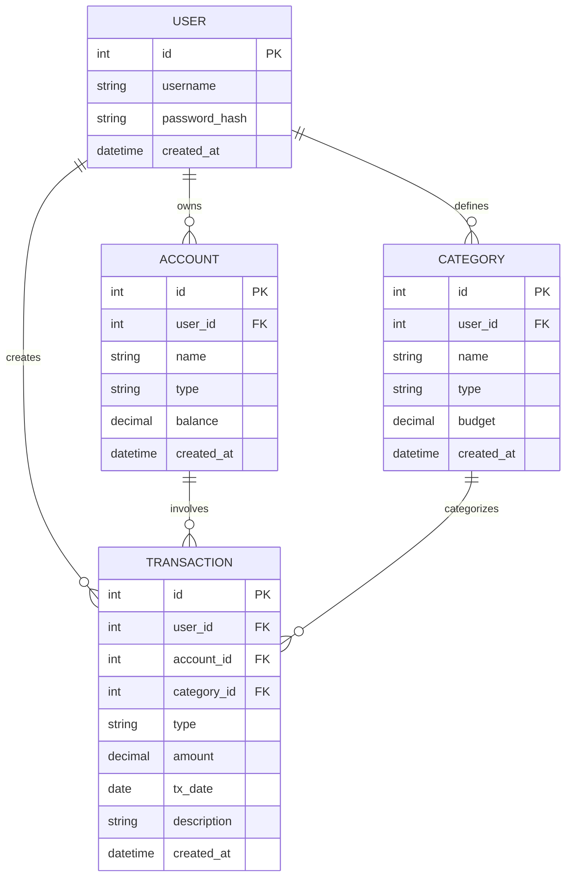

# 資料庫設計文件 - 個人記帳簿

本文件根據 PRD 與系統架構，定義 SQLite 資料表的結構與關聯。

## 1. ER 圖（實體關係圖）

## 2. 資料表詳細說明

### USER (使用者表)
儲存使用者的登入資訊。
- `id` (INTEGER): Primary Key, 自動遞增。
- `username` (TEXT): 必填，唯一，登入帳號。
- `password_hash` (TEXT): 必填，雜湊後的密碼。
- `created_at` (DATETIME): 建立時間，預設為當前時間。

### ACCOUNT (資金帳戶表)
儲存使用者的各個帳戶（如現金、銀行）與餘額。
- `id` (INTEGER): Primary Key, 自動遞增。
- `user_id` (INTEGER): Foreign Key，關聯至 `USER.id`。必填。
- `name` (TEXT): 必填，帳戶名稱（如「郵局」、「錢包」）。
- `type` (TEXT): 必填，帳戶類型（如「現金」、「銀行」、「電子支付」）。
- `balance` (REAL): 必填，帳戶餘額，允許小數。預設 0。
- `created_at` (DATETIME): 建立時間。

### CATEGORY (消費/收入分類表)
儲存收支分類，並支援設定每月預算。
- `id` (INTEGER): Primary Key, 自動遞增。
- `user_id` (INTEGER): Foreign Key，關聯至 `USER.id`。必填。
- `name` (TEXT): 必填，分類名稱（如「餐飲」、「薪水」）。
- `type` (TEXT): 必填，分類型態（`income` 或 `expense`）。
- `budget` (REAL): 每月預算金額，非必填（預設 0）。
- `created_at` (DATETIME): 建立時間。

### TRANSACTION (收支紀錄表)
儲存每一筆收入或支出明細。
- `id` (INTEGER): Primary Key, 自動遞增。
- `user_id` (INTEGER): Foreign Key，關聯至 `USER.id`。必填。
- `account_id` (INTEGER): Foreign Key，關聯至 `ACCOUNT.id`。必填。
- `category_id` (INTEGER): Foreign Key，關聯至 `CATEGORY.id`。必填。
- `type` (TEXT): 必填，收支型態（`income` 或 `expense`）。
- `amount` (REAL): 必填，交易金額，需為正數。
- `tx_date` (TEXT): 必填，交易日期（格式 `YYYY-MM-DD`）。
- `description` (TEXT): 備註說明，非必填。
- `created_at` (DATETIME): 建立時間。

## 3. SQL 建表語法

完整的 SQLite CREATE TABLE 語法已儲存於 `database/schema.sql` 檔案中。

## 4. Python Model 程式碼

針對每一個資料表，已於 `app/models/` 資料夾中建立對應的 Python 類別，封裝基本的 CRUD 操作（採用 sqlite3），包含：
- `database.py` (連線與初始化工具)
- `user.py`
- `account.py`
- `category.py`
- `transaction.py`
- `__init__.py` (對外匯出介面)
