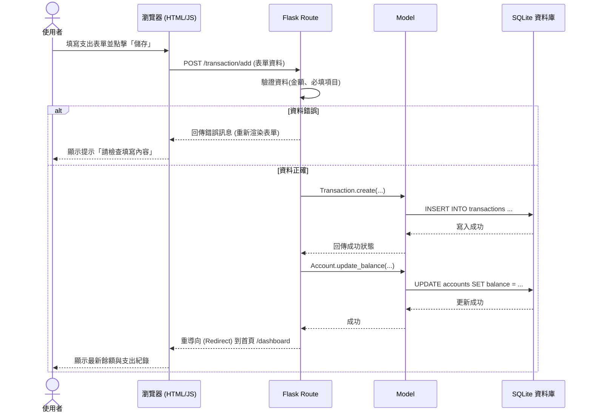

# 流程圖設計文件 - 個人記帳簿

本文件根據 PRD 需求與系統架構設計，描繪使用者的操作流程與系統內部的資料流動。

## 1. 使用者流程圖（User Flow）

這張圖展示了使用者進入系統後，可以進行的各種操作路徑：

```mermaid
flowchart LR
    Start([使用者開啟網頁]) --> Auth{是否已登入？}
    Auth -->|否| Login[登入 / 註冊頁面]
    Login -->|成功| Dashboard
    Auth -->|是| Dashboard[首頁儀表板\n(顯示餘額、淨資產、圖表)]

    Dashboard --> Action{要執行什麼操作？}
    
    Action -->|新增收支| AddTx[填寫收支表單\n(金額、分類、帳戶、日期)]
    AddTx --> Dashboard
    
    Action -->|查看歷史紀錄| ViewTx[收支歷史明細頁面]
    ViewTx --> EditTx[編輯或刪除收支]
    EditTx --> ViewTx
    
    Action -->|管理多帳戶| AccountMgr[帳戶管理頁面\n(新增、編輯帳戶)]
    AccountMgr --> Dashboard
    
    Action -->|設定預算| BudgetMgr[預算設定頁面]
    BudgetMgr --> Dashboard
```

## 2. 系統序列圖（Sequence Diagram）

以下序列圖展示了「使用者新增一筆支出」時，瀏覽器、Flask 後端與資料庫之間的完整互動流程：



## 3. 功能清單對照表

以下表格對應了系統的主要功能、規劃的 URL 路徑與 HTTP 請求方法：

| 功能項目 | 說明 | URL 路徑 | HTTP 方法 |
| --- | --- | --- | --- |
| **首頁儀表板** | 顯示淨資產、當月收支與圓餅圖 | `/dashboard` | GET |
| **登入系統** | 驗證使用者身分 | `/login` | GET / POST |
| **註冊帳號** | 建立新使用者 | `/register` | GET / POST |
| **登出系統** | 清除登入狀態 | `/logout` | GET |
| **新增收支** | 填寫表單建立新的收入或支出 | `/transaction/add` | GET / POST |
| **歷史紀錄** | 列出所有的收支明細 | `/transaction/history` | GET |
| **編輯收支** | 修改既有的紀錄 | `/transaction/edit/<id>` | GET / POST |
| **刪除收支** | 刪除既有的紀錄 | `/transaction/delete/<id>`| POST |
| **帳戶管理** | 新增或編輯資金帳戶（現金、銀行等） | `/account` | GET / POST |
| **設定預算** | 設定各分類的每月預算 | `/budget` | GET / POST |
